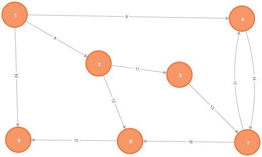

# QueryEngine
Is a query program for graphs. It gets four files, schemas for edges and vertices, and lastly, files with particular nodes and edges. Then, the user is asked to enter a query. (Query language is a subset of PGQL).

## Input files

### NodeTypes.txt/EdgeTypes.txt [Json syntax]

They consists only of an json array. Inside of the array, there are objects and each object represents one type ( a table ) of a node/an edge.
Each type must include at least one property, that is **Kind** with a value that is a name of the table.
Afterwards, there are defined properties of the table. A name of the field determines a name of  the table, whereas the values contain their types.

Available types:

| Inner Type      | Value of a Propery |
| ----------- | ----------- |
| string      | string       |
| int (32)  | integer        |


>Example 
``` 
[
{
"Kind": "Person",
"Name": "string",
"LastName": "string",
"Age": "integer"
},
{
"Kind": "Friend"
}
]
```

### Nodes.txt & Edges.txt

Files include particular nodes and edges.

Stored data in files:

#### For vertices:

    ID Type Properties

Ids must be sorted in ascending order.
Properties go one after another as there are defined in the data scheme.
Ids do not have to start from 0.  

#### For edges:

    ID Type FromVertexID ToVertexID Properties 

The same rule applies as for vertices, except the edges must be sorted according to the vertex IDs. That is, if there are three vertices with ids 1 2 3.
After a double dot it expects edges that start with FromVertexID 1, then edges with FromVertexID 2 and so on.
Edges IDs and Vertices IDs must be different. There can not be edge with id 1 and simultaneously vertex with id 1. The id must be unique
in entire graph. 

>Example

```
Nodes.txt
0 Person Pavel Mikulas 21
1 Person Patrik Peska 40
2 Person Max Slev 20
...

Edges.txt
4 BasicEdge 0 1
5 BasicEdge 0 2
6 BasicEdge 1 0
7 BasicEdge 2 0
...
```

## Query

Queries must be inputted in a PGQL syntax. So far, only select, match, order by work.
General expressions used inside the query work only as variable references and property references. Query words (match, select, as ...) are case-insensitive but variable names, 
property names and labels are case-sensitive.

### Expressions

Inside the inputed query, there can be used expressions that will be evaluated for each individual result.
The expression consists, so far, only of variable reference or property reference. In a select clause, expressions can be followed by "AS Label" which defines names of columns in the output.

>Example:

    Select consits of expressions. That is, SELECT expression, expression ..., given a query: select x, x.Age as Age match (x); it consits of two expressions x and x.Age which name is set to Age. The results will be printed into two columns where the displayed values in those columns are values computed of these two expressions. The header of the printed table have  the same the names as either the expressions as they were written or the labels.

### Select syntax
SELECT expression starts with SELECT word and expects expressions (consisting only of variable and property references).
Each expression represents one column of the final printed table. Values in the columns are computed for each row of the result with the given expressions. The header of the final table is defined as the name of the expression.

Types of referrences:

| Syntax      | Description |
| ----------- | ----------- |
| *      | Selects all variables from match expression       |
|  x  | Selects a specified variable from match expression, equivalent of an id(x) function      |
|  x.Name  | Selects a specified property of a specified variable     |

Inside the select expression can be either * or variable referrences. If the * is chosen, then all variables from a match expression are selected. Selecting a variable with its name will cause the same effect as if a function id(x) was called, so the results are the unique ids of the matched graph elements. When selecting a property of a variable, if the variable has defined type and the accessed property does not exist in the entire data schema it will throw an error, otherwise, if it is missing only in the variable table but exists in the graph, accessing the property will generete a null value.

Each expression is comma separated.

>Example: 
    
    SELECT x as xID, x.Age as xAge, y match (x)->(y);
    SELECT * match (x) -[e]-> (y); <=> SELECT x, e, y match (x) -[e]-> (y);

### Match syntax
Match expression starts with MATCH word and expects pattern to match. There can be more patterns separated by comma.
Variables must consist of alpha characters, and the names are case sensitive.

Types of vertices:


| Syntax      | Description |
| ----------- | ----------- |
| ()      | Anonymous vertex       |
|  (x)  | Defined vertex with name x        |
|  (:Person)  | Anonymous vertex with defined type        |
|  (x:Person)  | Defined vertex with defined type        |


Types of edges:


| Syntax      | Description |
| ----------- | ----------- |
| -      | Anonymous any direction edge       |
| -> | Anonymous out direction edge     |
|  <-  | Anonymous in direction edge         |
|  -[e]->  | Defined out direction edge with name e       |
|  <-[e]-  | Defined in direction edge with name e        |
|  -[e]-  | Defined any direction edge with name e        |
|  -[:BasicEdge]->  | Anonymous edge with defined type        |
|  -[e:BasicEdge]->  | Defined edge with defined type        |


Every vertex is enveloped in () and every non-anonymous edge is enveloped in []. Variables of vertices can repeat (edges cannot) and also edge variables and vertex variables cannot have the same name. Moreover, once a variable is defined, the type cannot change in next repetition of variable. When repeating variable with defined type, the type must be included in every occurence.

>Example: 

    SELECT x MATCH (x:Person)->(y)->(x:Person); (correct) SELECT x MATCH (x:Person)->(y)->(x); (incorrect)
    SELECT x, y MATCH (x) -> (y), (y) -> (t:Person);

### Order by 
An Order by part is optional. If it is ommited the final results are not sorted in any order. If the part is included, the final results will be sorted according to included expressions. Order by can contain multiple expressions which causes sorting by the other expressions when two elements are same for a sooner expression.

| Syntax      | Description |
| ----------- | ----------- |
| expression ASC      | Sort according to the expression in ascending order      |
| expression DESC | Sort according to the expression in descending order      |

If ASC and DESC are ommited the ordering is implicitly set to ascending order.

>Example:

    SELECT x, x.Age, y match (x) -> (y) order by x.Age ASC, x, y DESC; 

### Inputing a query
1. Query must consists of SELECT expression with at least one variable refference to a variable in Match expression. Or an *. Also, the query must consists of a MATCH expression with at least one match expression.
>Example:

     SELECT x MATCH (x)->(y); (correct), SELECT y MATCH (x)->(z); (incorrect),
     SELECT * MATCH (x); (correct)
     SELECT * MACTH (); (incorrect) match expression must contain at least one defined variable.

2. Every query main word (SELECT, MATCH...) must be separated by space.

>Example:

     SELECTxMATCH(x)->(y); (incorrect)
     SELECT x MATCH (x)->(y);

3. Every match chain must consists of either a vertex or a pattern.
There can not be a pattern with edge that has no specified end.

>Example:

    SELECT * MATCH (x) -[e:BasicEdge]- ; (incorrect)

4. Every query must end with a semicolon ";".

5. The match expression must consist of at least one defined variable.

6. Both SELECT and MATCH can not be empty or ommited. Other parts, such as Order by, are optional. 

## Running the application

Application is run with 5 arguments (noted below). The program has simple api. Upon start of the program a user is prompted to input a query. After inputting the query, the user must press an enter. Then the program evaluates the query and displays the results (file or console).
After evaluation user will be prompted to press an enter again. Then the user will be asked if he wants to input another query or close the application by inputing "y" to continue or anything else for closing the application.

### Commandline arguments

The application expects 5 arguments in a given order.

| Argument      | Description | Optional |
| ----------- | ----------- | ----------- |
| Thread number      | A number of threads for computation of queries.       | No |
|  Printer   | Type of a printer.        | No |
|  Formater  | Formating of a printing table.    | No |
|  Vertices per Thread  | Defines the number of vertices that will be distributed to each thread. | Yes (Must be inputted if the thread number is greater than 1) |
| File name | A name of a file only if printer is defined as a "file" printer | Yes (Must be inputted if the printer is set to "file".) |

#### Printer 

The user can choose between a "console" or "file" printer.
Console printer will print results into a console and file printer will print results into given file name.
If more queries are inputed the names of a file is concatenated with the number of the query.

#### Formater

The user can choose between a "simple" or a "markdown" formater.
The simple formater prints results only separated by a comma and markdown formater prints results in a markdown format.

### Inputing
Upon a start of the application user is prompted to enter a query expression that must be ended with a semicolon.
Application asks the user if he wants to enter another query or end the application.
The user enters specified character from a displayed table.

## A test graph and example queries.

 Nodes.txt :

```
1 Person Pavel Jezek 35
2 Person Lubomir Bulej 39
3 Person Jarek Kaufman 21
4 Person Pavel Mikulas 22
5 Person Jiri Klepl 22
6 Person Radek Ostruszka 25
7 Person Ivana Kaufmanova 35
```
NodeTypes.txt
```
[
{
"Kind": "Person",
"Name": "string",
"LastName": "string",
"Age": "integer"
}
]
```
Edges.txt
```
8 isFriend 1 2 11
9 isFriend 1 4 22
10 isFriend 1 5 3
11 isFriend 2 3 2
12 isFriend 2 6 6
13 isFriend 3 7 8
14 isFriend 4 7 2
15 isFriend 6 5 1
16 isFriend 7 6 4
17 isFriend 7 4 9
```
EdgeTypes.txt
```
[
{
"Kind": "isFriend",
"For": "integer"
}
]
```



SELECT x MATCH (x);

SELECT x, y MATCH (x)->(y);

SELECT * MATCH (x)->(y);

SELECT x, x.Age, y, y.Age MATCH (x)->(y) ORDER BY x.Age DESC;

SELECT x, y MATCH (x)->(y), (y)->(x);

SELECT x MATCH (x)-[e]->(y)-[p]->(x);

SELECT y MATCH (x)->(y), (y)->(k), (y)->(p);

SELECT x MATCH (x)-[e]->(y), (x)-[r]->(p)-[t]->(z)-[o]->(y);

SELECT x MATCH (x)<-[e]-(y), (x)<-[p]-(z); 

## Installation 

1.  git clone "repository"
2.  cd "repository"
3.  git submodule init
4.  git submodule update
5.  open in visual studio
6.  compile for your platform (preferably 64x)  