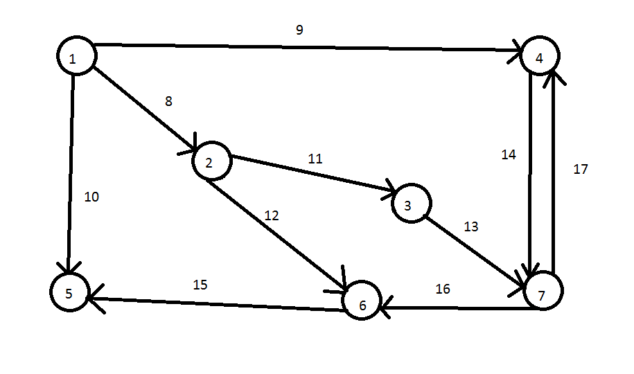

# QueryEngine
Is a query program for graphs. It gets four files, schemas for edges and vertices, and lastly files with particular nodes and edges. Then, the user is asked to enter a query. (Query language is a subset of PGQL).

## Input files

### NodeTypes.txt/EdgeTypes.txt [Json syntax]

They consists only of json array. Inside of the array, there are listed objects. Each object represents one type(table) of a node/an edge.
Each of the types must include at least one property, that is **Kind** with a value referring to it is name.
Afterwards, there comes properties of the table. As values pertaining to the property type it gets one of the following:

| InnerType      | value of propery |
| ----------- | ----------- |
| String      | string       |
| Int   | integer        |

>Example 
``` 
[
{
"Kind": "Person",
"Name": "string",
"LastName": "string",
"Age": "integer"
},
{
"Kind": "Friend"
}
]
```

### Nodes.txt & Edges.txt

Files include particular nodes and edges.

Stored data in files:

#### For vertices:

    ID Type Properties

Ids must be sorted in ascending order.
Properties goes as there are in data scheme.

#### For edges:

    ID Type FromVertexID ToVertexID Properties 

The same rule apply except the edges must be sorted according to the vertex IDs. That is, if we have three vertices with ids 1 2 3.
After double dot we expect edges that starts with FromVertexID 1, then edges with FromVertexID 2 and so on.
Edges IDs and Vertices IDs must be different. There can not be edge with id 1 and simultaneously vertex with id 1. The id must be unique
in entire graph. 

>Example

```
Nodes.txt
1 Person Pavel Mikulas 21
2 Person Patrik Peska 40
3 Person Max Slev 20
...

Edges.txt
4 BasicEdge 1 2
5 BasicEdge 1 3
6 BasicEdge 2 1
7 BasicEdge 3 1
...
```

## Query

Using PGQL syntax subset.
So far only Match expression works.

### Select syntax
SELECT expression starts with SELECT word and expects variable names reffering to the variables in Match expression. If the variable in Match expression has defined type, you can access the properties of that type throught the variable.

Types of referrences:

| Syntax      | Description |
| ----------- | ----------- |
| *      | Selects all variables from match expression       |
|  x  | Selects a specified variable from match expression       |
|  x.Name  | Selects a specified property of a specified variable     |

Inside select expression can be either * or variable referrences. If the * is chosen, then all variables
from a match expression are selected. Based on their defined type the columns are constructed. If a variable has got it's type defined, the * creates a separate column for each property of the type. Otherwise, there will be one column for the entire variable and it's values will be grouped into that column. The same effect is done even if we specify the variable with no defined type and vice versa. 

Each referrence is comma separated.

### Match syntax
Match expression starts with MATCH word and expects pattern to match. There can be more patterns separated by comma.
Variables must consist of alpha characters, and the names are case sensitive.

Types of vertices:


| Syntax      | Description |
| ----------- | ----------- |
| ()      | Anonymous vertex       |
|  (x)  | Defined vertex with name x        |
|  (:Person)  | Anonymous vertex with defined type        |
|  (x:Person)  | Defined vertex with defined type        |


Types of edges:


| Syntax      | Description |
| ----------- | ----------- |
| -      | Anonymous any direction edge       |
| -> | Anonymous out direction edge     |
|  <-  | Anonymous in direction edge         |
|  -[e]->  | Defined out direction edge with name e       |
|  <-[e]-  | Defined in direction edge with name e        |
|  -[e]-  | Defined any direction edge with name e        |
|  -[:BasicEdge]->  | Anonymous edge with defined type        |
|  -[e:BasicEdge]->  | Defined edge with defined type        |


Every vertex is enveloped in () and every non-anonymous edge is enveloped in []. Variables can repeat, however edge and vertex cannot have the same name. Also once defined variable, the type cannot change in next repetition of variable. When repeating variable with defined type, the type must be included in every occurence.

>Example: 

    SELECT x MATCH (x:Person)->(y)->(x:Person); (correct) SELECT x MATCH (x:Person)->(y)->(x); (incorrect)

### Inputing a query
1. Query must consists of SELECT expression with at least one variable refference to a variable in Match expression. Or an *. Also, the query must consists of a MATCH expression with at least one match expression.
>Example:

     SELECT x MATCH (x)->(y); (correct), SELECT y MATCH (x)->(z); (incorrect),
     SELECT * MATCH (x); (correct)

2. Every query main word (SELECT, MATCH...) must be separated by space.

>Example:

     SELECTxMACTH(x)->(y); (incorrect)

3. Every match chain must consists of either singular vertex or a pattern (vertex) (edge) (vertex).
There can not be a pattern with edge that has no specified end.

>Example:

    SELECT * MATCH (x) -[e:BasicEdge]- ; (incorrect)

4. Every query must end with a semicolon ";".

5. The match expression must consist of at least one defined variable.

6. Both SELECT and MATCH can not be empty or ommited.


## Running the application

### Commandline arguments

The application expects 5 arguments in a given order.

| Argument      | Description |
| ----------- | ----------- |
| Thread number      | A number of threads for computation of queries.       |
|  Vertices per Thread  | Defines the number of vertices that will be distributed to each thread. (Only if more than one thread is specified)        |
|  Printer   | Type of a printer.       |
|  Formater  | Formating of a printing table.       |
| File name | A name of a file if printer is defined as a file printer |

#### Printer 

The user can choose between a "console" or "file" printer.
Console printer will print results into a console and file printer will print results into given file name.
If more queries are inputed the names of a file is concatenated with the number of the query.

#### Formater

The user can choose between a "simple" or a "markdown" formater.
The simple formater prints results only separated by a comma and markdown formater prints results in a markdown format.

### Inputing
Upon a start of the application user is prompted to enter query expression ended with semicolon.
Application asks the user if he wants to enter another query or end the application.
The user enters specified character from a displayed table.

## Example queries for test graph.



SELECT x MATCH (x);

SELECT x MATCH (x)->(y);

SELECT x MATCH (x)->(y), (y)->(x);

SELECT x MATCH (x)-[e]->(y)-[p]->(x);

SELECT x MATCH (x)->(y), (y)->(k), (y)->(p);

SELECT x MATCH (x)-[e]->(y), (x)-[r]->(p)-[t]->(z)-[o]->(y);

SELECT x MATCH (x)<-[e]-(y), (x)<-[p]-(z); 


